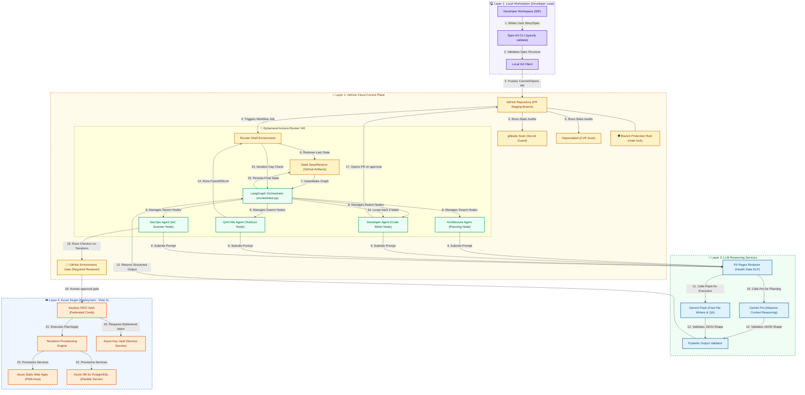
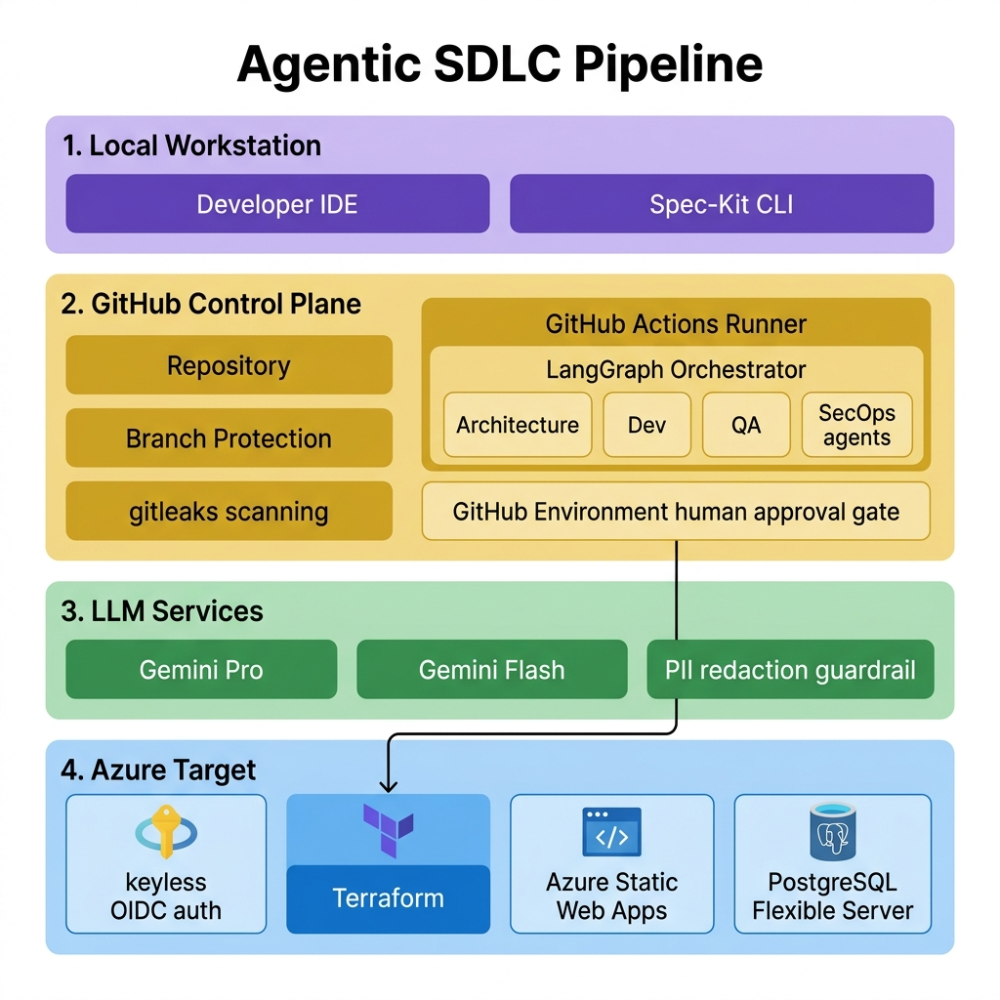

# Agentic SDLC Pipeline Architecture Design
This document outlines the architecture for an open-source, serverless, and extremely cost-conscious **Agentic Software Development Lifecycle (SDLC) Pipeline** for **Ovify**. 

The design has been simplified to run the entire **control plane on GitHub-hosted runners (ephemeral VMs)**. Azure acts strictly as the **deployment target (Role 3)**, resulting in zero compute infrastructure costs for hosting the agent orchestrator.

> **Companion docs:** agent personas, behaviour/token guardrails, cost management, and persistent-memory guidance live in [`agents_and_guardrails.md`](agents_and_guardrails.md). A full learning guide to LLMOps, RAG, evals, guardrails, security, and tooling is in [`llmops_deep_dive.md`](llmops_deep_dive.md). Runtime flow → [`sequence_diagram.md`](sequence_diagram.md). Component connectivity → [`component_diagram.md`](component_diagram.md).

---

## 1. Architectural Blueprint (System Overview)

The diagram below illustrates the flow from specification to deployment. The **Control Plane** resides entirely within GitHub's cloud using free-tier runners (2,000 minutes/month).



### Visual Architecture Diagram (Vibrant & Detailed Layers)


### Detailed Description of Architecture Layers

The architecture consists of four logically isolated layers designed to separate concerns, enforce governance gates, control compute budgets, and secure data pipelines.

#### Layer 1: Local Workstation (The Developer Loop)
* **Objective:** Sandbox environment for developers to refine specifications, run local mock verification, and write standard spec files before triggering automated remote pipelines.
* **Key Components:**
  * **Developer Workspace (IDE/CLI):** Code editing interface where standard developer tools are executed.
  * **Spec-Kit Engine:** Validates the presence and structural format of the required files (`constitution.md`, `spec.md`, `plan.md`, `tasks.md`) under the local `.spec-kit` config folder.
  * **Local MCP Host:** Connects to the local filesystem and CLI tools to facilitate rapid testing cycles without triggering remote API billing.
* **Control/Security Gate:** No code can be pushed to remote branches without passing the local Spec-Kit lint check (`specify validate`).

#### Layer 2: GitHub Control Plane (Swarm Orchestration)
* **Objective:** Ephemeral build environment that coordinates the LangGraph agents, manages workflow state, runs automated verification checks, and enforces structural branch protection.
* **Key Components:**
  * **GitHub Actions Runner:** An ephemeral VM spun up dynamically upon PR creation. Runs standard python scripts and executes workspace jobs.
  * **LangGraph Swarm (Orchestrator Node):** Ephemeral state manager driving the agent nodes (Architecture, Developer, QA, SecOps). Maintains a cycle counter (`iteration`) to enforce the budget loop guardrail.
  * **Branch Protection:** Native platform gate protecting `main` from direct agent write-access. Forces code output to remain in staging branches until audited.
  * **Environment Gates (Required Reviewers):** A hard environment boundary blocking the final `terraform apply` deployment step until a human administrator approves it.
* **Control/Security Gate:** Ephemeral runner timeout caps execution (configurable — see §5.A; ~20 min for trivial tasks, 30–45 min for real multi-file features); branch rules block automated merging.

#### Layer 3: LLM Reasoning Services (AI Backend & Guardrails)
* **Objective:** Serves as the cognitive engine of the pipeline while safeguarding outputs and input tokens.
* **Key Components:**
  * **Gemini Pro API:** Massive-context reasoning engine used by the Architecture Agent to design technical blueprints and construct system schemas.
  * **Gemini Flash API:** High-speed, low-cost API utilized for code implementation, test parsing, and code-review checks.
  * **Guardrails Processor (PII and Schema Scrubber):** Python-based pipeline that strips PII data (Emirates ID, patient numbers) using regex before prompt evaluation, and uses Pydantic to validate that the LLM response strictly conforms to defined JSON shapes.
* **Control/Security Gate:** Input tokens are scrubbed of sensitive health data, and outputs are strictly type-validated before code execution.

#### Layer 4: Azure Target Deployments (Deployment Target - Role 3)
* **Objective:** Target cloud environment hosting the business application. It operates entirely as a passive recipient of infrastructure changes and code deployments.
* **Key Components:**
  * **Terraform Engine:** Deploys Infrastructure as Code (IaC) to create or configure Azure services.
  * **Azure Static Web Apps (SWA):** Serverless platform hosting the frontend Progressive Web App (PWA).
  * **Azure Database for PostgreSQL (Flexible Server):** Cost-effective, relational database storage tailored for scheduling and cycle day logic.
  * **Azure Key Vault:** Key vault securing service connection strings and system secrets, accessed keylessly via OpenID Connect (OIDC) from the GitHub Runner.
* **Control/Security Gate:** Infrastructure modifications are scanned for compliance (Trivy/Checkov) before cloud execution, and OIDC keys expire instantly post-deployment.

---

## 2. Core Architectural Pillars & Open-Source Tech Stack

### A. Spec-Driven Development (Spec-Kit)
To prevent agents from "vibe coding" (writing unstructured code that misses requirements), we enforce a strict documentation-first flow. 
* **Config Directory (`.spec-kit/`):**
  * `constitution.md`: The rulebook for how agents must operate (e.g., UAE Health Data compliance, security guidelines, serverless constraints).
  * `spec.md`: The functional requirement (User Story / BRD excerpt).
  * `plan.md`: The technical architecture design, API schemas, and component breakdown.
  * `tasks.md`: A strict checklist of checkable tasks (a standard Markdown Todo list).
* **Validation Gating:** 
  * A GitHub Action step executes `specify-cli` to validate that a PR contains all four documents before allowing any code execution to begin.

### B. Ephemeral Swarm Orchestration (LangGraph on GitHub Runners)
Instead of running a stateful orchestrator on Azure 24/7, the LangGraph agent swarm runs entirely inside the **GitHub-hosted runner VM** during the workflow lifecycle.
* **Cost Efficiency:** Utilizes GitHub’s free tier (2,000 minutes/month for private repos, unlimited for public repos). There are zero infrastructure costs for hosting the control plane.
* **Stateful Flow:** LangGraph handles the iterative loops (e.g., *Dev writes code* $\rightarrow$ *QA Agent compiles and runs tests* $\rightarrow$ *Fails* $\rightarrow$ *Dev Agent gets logs and fixes code*) inside the runner memory space.
* **Graph State Schema:** A unified state object containing:
  ```python
  class SDLCState(TypedDict):
      spec: str
      plan: str
      tasks: List[dict]
      code_diffs: Dict[str, str]
      test_results: dict
      security_report: dict
      critic_feedback: List[str]
      status: str  # "specifying", "planning", "implementing", "verifying", "approved", "failed"
      iteration: int       # current Dev<->QA loop count (incremented by the QA node on each failed cycle)
      max_iterations: int  # hard cap; when iteration >= max_iterations, the graph routes to "failed"
  ```
* **Loop Guardrail (max-iterations — mandatory):** The Dev↔QA cycle is a graph loop, which means a failing test the Developer Agent cannot fix will otherwise loop *Dev → QA → fail → Dev* indefinitely — burning the Gemini quota and eventually hitting our **20-minute job cap** (well inside GitHub's 6-hour platform maximum), dying with no useful output. The `max_iterations` counter — not the wall-clock timeout — is the **primary** loop guard; the timeout is only the backstop. To prevent this:
  * The **QA/Critic node** increments `iteration` on every failed cycle.
  * A **conditional edge** evaluates the loop exit:
    ```python
    def should_retry(state: SDLCState) -> str:
        if state["test_results"].get("passed"):
            return "approved"
        if state["iteration"] >= state["max_iterations"]:
            return "failed"   # stop looping; surface logs for a human
        return "retry"        # route back to the Developer Agent
    ```
  * On `"failed"`, the graph **halts and persists the last `test_results` / `critic_feedback`** (see §3.2) so a human gets actionable logs instead of a silent timeout.
  * Recommended default: `max_iterations = 3–5`. This single field is the most important cost and reliability guardrail in the pipeline — it caps the blast radius of a runaway agent loop.

### C. Deployment Target Only (Azure Role 3)
Azure is purely the target environment where the Ovify app is deployed. The runner uses secure OpenID Connect (OIDC) to authenticate with Azure without storing long-lived credentials.
* **Terraform:** Executed as a step in the runner to provision/update Azure resources (Azure Static Web Apps and **Azure Database for PostgreSQL — Flexible Server**).
* **Data store — PostgreSQL (chosen over Cosmos DB):** The Ovify domain is **relational and scheduling-heavy** — protocols, doses, timing windows, escalation state, and adherence logs are highly normalized and queried by time/relationship. PostgreSQL models this far more naturally than a document database; a document store would push relational logic into the application layer. Azure DB for PostgreSQL Flexible Server (Burstable B1ms tier, or auto-stop in dev) keeps cost low while remaining the correct data fit.
  * *Note:* If Cosmos DB is ever reintroduced, it should be a deliberate **learning** choice, not a data-fit decision.
* **SecOps Gating:** Before Terraform is applied, the **SecOps Agent** runs **Checkov** or **Trivy** locally on the runner to scan for cloud misconfigurations.

### D. LLM Reasoning Gateway (Gemini API)
We connect the runner to Google's Gemini models via an API key stored in **GitHub Secrets**:
* **Gemini 1.5 / 2.0 Pro:** Used by the *Architecture Agent* and *Orchestrator* to read the entire repository context window and build technical blueprints.
* **Gemini 1.5 / 2.0 Flash:** Used by the *Developer Agent* (writing files) and *QA/Critic Agent* (running test scripts and reviewing diffs) for ultra-fast, cheap processing.

### E. Governance & Safety Gates (Native GitHub Mechanisms)
An agent that writes code and provisions cloud infra must not be trusted to merge or deploy on its own. These three gates are all **free and native to GitHub** — no hand-rolled logic required.

* **Human-in-the-Loop Approval via GitHub Environments (deploy gate):** The destructive step (`terraform apply`) targets a protected **GitHub Environment** (e.g., `production`) configured with **Required Reviewers**. When the workflow reaches that environment, **GitHub pauses the run and notifies a human**; `terraform apply` executes only after explicit approval. This is the correct, native mechanism for gating an agent-driven infrastructure change — *not* the artifact-based state save (which is for resuming `SDLCState`, a separate concern — see §3.2).
* **Branch Protection (merge gate):** The Developer Agent **opens a PR; it never merges.** A **branch protection rule on `main`** enforces this even if the agent attempts a direct merge — requiring passing checks and a human (or `CODEOWNERS`) review before merge. For a learning project this is also a vital safety net while debugging agent behaviour.
* **Code & Dependency Scanning (not just IaC):** Checkov/Trivy (§2.C) scan Terraform, but the **application code the Developer Agent writes** must be scanned too:
  * **gitleaks** — secret scanning. Agents occasionally paste API keys or credentials into code; this blocks them before they reach history. (Mandatory.)
  * **Dependabot** — dependency CVE + version alerts. Free and on by default for GitHub repos.
  * *(SAST such as Sonar/CodeQL can be added later; secret-scanning cannot wait.)*

---

## 3. What Else Do We Need to Productionize?

To take this simplified architecture to production, we must implement:

### 1. Azure OIDC Authentication (Keyless Security)
To avoid storing raw Azure credentials in GitHub Secrets:
* **Action:** Configure **Federated Credentials** on the Azure Service Principal. This allows the GitHub-hosted runner to request temporary Azure OAuth tokens dynamically using OIDC.

### 2. State Persistence (Lightweight Checkpointing)
Since GitHub runners are ephemeral, the LangGraph state is lost when the VM terminates.
* **Action:** To resume a multi-run cycle, save the serialized `SDLCState` JSON to **GitHub Workflow Artifacts** or an **Azure Blob Storage** container at the end of a run, and restore it at the start of the next run.
* **Note — this is state *persistence*, not the approval gate.** Human approvals are handled natively by **GitHub Environments + Required Reviewers** (see §2.E), not by hand-rolled artifact logic. Use artifacts only to carry `SDLCState` across runner restarts.

### 3. OpenTelemetry Observability (Tracing Swarms)
Tracing agent executions (prompts, tool inputs/outputs, costs) is vital for debugging.
* **Action:** Configure the LangGraph script to send OpenTelemetry trace payloads to **Langfuse** (self-hosted or cloud) using API keys in GitHub Secrets.

### 4. Regulatory Data Gating (UAE MOHAP/DHA Compliance)
The pipeline must ensure no real patient healthcare data is ever passed to the Gemini API during tests or code analysis.
* **Primary control:** No real patient data belongs in the repository at all — use synthetic/masked fixtures. The scrubber is a **backstop**, not the first line of defence.
* **Action:** Install a validation pre-commit hook or pipeline step that scans code/test fixtures for PII patterns (regex; NLP layer optional/future) before passing data to LLMs.
* **Scope boundary (important):** This guard protects the **build pipeline** only. The separate and higher-stakes concern — the **live application** sending patient data to an LLM at runtime — is an *application-architecture* data-residency decision (region-compliant endpoint / UAE-hosted model) and is **out of scope for this document**.

---

## 4. Next Steps for Implementation
1. **Configure GitHub Secrets:** Add `GEMINI_API_KEY` and Azure OIDC secrets.
2. **Enable governance gates (§2.E):**
   * Turn on **branch protection** for `main` (require PR + passing checks; no direct agent merge).
   * Create a **`production` Environment** with **Required Reviewers** to gate `terraform apply`.
   * Enable **Dependabot** and add a **gitleaks** scan step to the workflow.
3. **Create GitHub Actions Workflow (.github/workflows/agent-sdlc.yml):** Set up the runner steps to check out the repo, install Python, and execute the LangGraph script — with the `terraform apply` step bound to the gated `production` environment.
4. **Write Python LangGraph Swarm:** Code the orchestrator script to run the Spec, Plan, Task, and Implement agents — including the `max_iterations` loop guardrail (§2.B) and a Developer Agent that **opens a PR rather than merging**.

---

## 5. Governance & Guardrails Specification

To ensure this agentic SDLC pipeline is safe for a healthcare context and does not incur runaway costs, the following guardrails must be implemented.

### Summary of Guardrail Architecture

| Guardrail Type | Objective | Implementation Mechanism | Enforcement Level |
| :--- | :--- | :--- | :--- |
| **1. Execution Loop Guard** | Prevent runaway loops, api quota drain, and job timeouts. | `max_iterations` check in LangGraph conditional edge. | **Automated (Runner)** |
| **2. Time Gating** | Prevent hung runs from using full 6-hour runner limits (backstop to the iteration cap). | `timeout-minutes` on GitHub Actions job (configurable: ~20 trivial / 30–45 real features). | **Automated (GitHub)** |
| **3. Merge Protection** | Prevent unauthorized agent changes from hitting `main`. | GitHub **Branch Protection Rules** (require PR, approvals, checks). | **Platform (GitHub)** |
| **4. Deployment Protection** | Prevent unauthorized agent infra changes from hitting Azure. | GitHub **Environments + Required Reviewers** on `terraform apply`. | **Platform (GitHub)** |
| **5. Secret Leak Guard** | Prevent agents committing secrets or API keys in code. | `gitleaks` step in the runner workflow. | **Automated (PR Check)** |
| **6. Infrastructure Guard** | Detect public storage, open ports, unencrypted DBs in Terraform. | `Checkov` or `Trivy` static analysis scans. | **Automated (PR Check)** |
| **7. PII / Healthcare Guard** | Backstop against patient data (DHA/MOHAP compliance) leaking to LLMs from the build pipeline. | Pre-LLM payload **regex** scrubber (NLP layer optional/future). Primary control = no real patient data in the repo. | **Automated (Python)** |
| **8. LLM Schema Guard** | Prevent malformed agent outputs or SQL/script injections. | **Pydantic** structured model outputs and validation. | **Automated (Python)** |

---

### Detailed Guardrail Implementations

#### A. Execution & Budget Guardrails
* **Runner Step Timeouts:** Never let the orchestrator script run without limits. 
  ```yaml
  jobs:
    agent-swarm:
      runs-on: ubuntu-latest
      timeout-minutes: 30  # Backstop only. ~20 for trivial tasks; raise to 30-45 for
                           # real multi-file features so the job is not killed mid-iteration.
  ```
  *The wall-clock timeout is a **backstop**, not the primary loop control — see the iteration cap below. Setting it too low (e.g., 20 min) on a non-trivial feature can kill the job mid-iteration and produce the very "no useful output" failure the iteration cap is meant to avoid.*
* **LangGraph Iteration Cap (primary loop guard):** Capped inside python state `max_iterations = 3`. If the Developer agent cannot pass the QA agent's tests in 3 attempts, the pipeline halts **gracefully with failure details** (logs persisted), rather than being killed by the wall-clock timeout.

#### B. Access & Platform Guardrails
* **No Client Secrets (Federated Credentials):** GitHub Actions authenticates with Azure using OpenID Connect (OIDC). The runner exchanges an ephemeral GitHub JSON Web Token (JWT) for a temporary Azure OAuth token, ensuring no static secrets exist in GitHub to be stolen.
* **Write Lock on Protected Branches:** The GitHub token used by the runner workflow is restricted to `read` permissions for repository content, forcing all changes to go through Pull Requests.

#### C. Code & Compliance Guardrails (DLP)
* **Secret Scanner (Gitleaks):** Gitleaks runs on the generated code diff. If it finds patterns resembling Azure Connection Strings, API keys, or JWT tokens, the run fails immediately.
* **PII Redaction (UAE Health Data Law compliance — build-pipeline backstop):** Before sending files or logs to the Gemini API, a Python pre-processor uses **regex** to replace phone numbers, Emirates IDs, emails, and medical file numbers with tokens (e.g., `[REDACTED_EMIRATES_ID]`). Regex is brittle (expect false negatives), so the primary control remains *no real patient data in the repo*. (An NLP-based scrubber is an optional future hardening.) Runtime LLM data residency for the live app is handled separately in the application architecture — see §3.4.

#### D. Input/Output (LLM) Guardrails
* **Strict Type Safety:** All LLM responses are parsed using Pydantic models (e.g. `StructuredOutputParser`). If the model outputs bad JSON or syntax, it triggers an auto-fix loop or fails safely.
  * **Cap the auto-fix loop:** This is a *second* retry loop, independent of the Dev↔QA `max_iterations` counter. Give it its own small cap (e.g., `max_parse_retries = 2`) so a model that keeps emitting malformed JSON cannot spin and drain quota outside the primary guardrail.
* **LLM Jailbreak Protections:** System prompts for each agent explicitly forbid outputting executables, modifying workflow configuration files, or accessing folders outside the workspace path.

