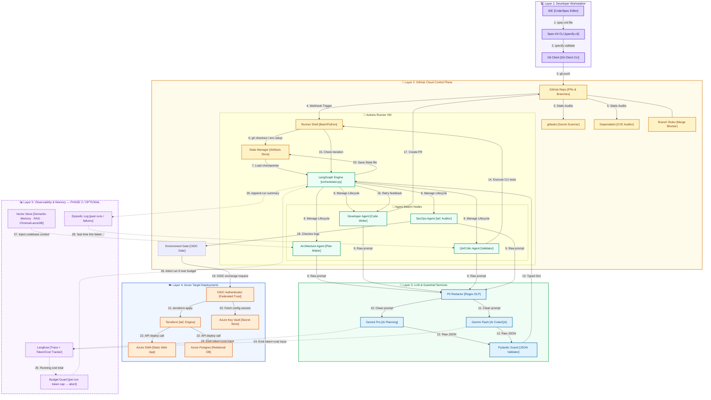

# Agentic SDLC Pipeline Component Diagram
This document contains the component diagram representing the logical structure, interfaces, dependencies, and step-by-step connectivity of the Agentic SDLC pipeline.

---

## 1. Component & Connectivity Diagram

The diagram below details the interfaces and connectivity between each system block, color-coded by architectural layer. Connector lines are annotated with the corresponding execution step number (1–23):

> **Dashed Layer 5 = Phase 2 / optional.** Build the solid path (steps 1–23) first. Add token/cost tracking (24–26) early — it is cheap and high-value. Add memory (27–29) only when context cost or repeated failures justify it (see [`agents_and_guardrails.md`](agents_and_guardrails.md) §6).

---

## 2. Component Interface Definitions

### Layer 1: Developer Workstation
* **Developer IDE:** Main text interface (VS Code / Cursor) where developer writes specifications in `.spec-kit/spec.md`.
* **Spec-Kit CLI:** Command Line executable that parses the local spec, compares it against `/constitution.md` schemas, and blocks commit triggers if specs are malformed.
* **Local Git Client:** Handles SSH pushes to GitHub repository.

### Layer 2: GitHub Cloud Control Plane
* **GitHub Repository:** The central host for PR triggers, branch controls, and pipeline logs.
* **GitHub Actions Runner VM:** Ephemeral container host executing tasks, installing dependencies, and compiling logs.
* **LangGraph Engine:** Python state chart manager (`orchestrator.py`) maintaining graph boundaries and routing loop execution.
* **Agent Nodes:** Stateless Python execution functions defining task behavior for each individual SDLC role.
* **State Manager:** Integrates with GitHub Runner artifacts (or Azure Blob Store) to load and save `SDLCState` JSON snapshots.

### Layer 3: LLM & Guardrail Services
* **PII Redactor:** Sanitization pipeline running string replacement regex rules on LLM payloads to prevent data leakage.
* **Gemini Pro Model:** Advanced planning model accessed via the Google Generative AI SDK, handling architectural decisions.
* **Gemini Flash Model:** High-throughput model handling direct code writing, compilation debug analysis, and QA logs parsing.
* **Pydantic Guard:** Validation script executing type assertions and checking for JSON injection issues.

### Layer 4: Azure Target Deployments
* **OIDC Authenticator:** Establishes trusted keyless identity federation via OpenID Connect to provision credentials dynamically.
* **Terraform Engine:** System provisioning compiler executing `terraform plan` and `apply`.
* **Target Services (SWA, PostgreSQL):** Live production application hosting database connections and Progressive Web App endpoints.

### Layer 5: Observability & Memory (Phase 2 / Optional)
*Dashed in the diagram — not part of the MVP pipeline. See [`agents_and_guardrails.md`](agents_and_guardrails.md) §5–§6.*
* **Langfuse:** Traces every LLM call with token counts and cost; the foundation for cost management and debugging the swarm. *Add early — cheap, high value.*
* **Budget Guard:** Reads the running cost total and **aborts the run** if a per-run token/$ budget is exceeded — the cost equivalent of the `max_iterations` guard.
* **Vector Store (Semantic Memory):** RAG index of the codebase (conventions, structure, glossary) so agents don't re-learn the project every run. *Add when context cost grows.*
* **Episodic Log:** Summaries of past runs/failures so agents avoid repeating mistakes. *Add when failures recur.*
